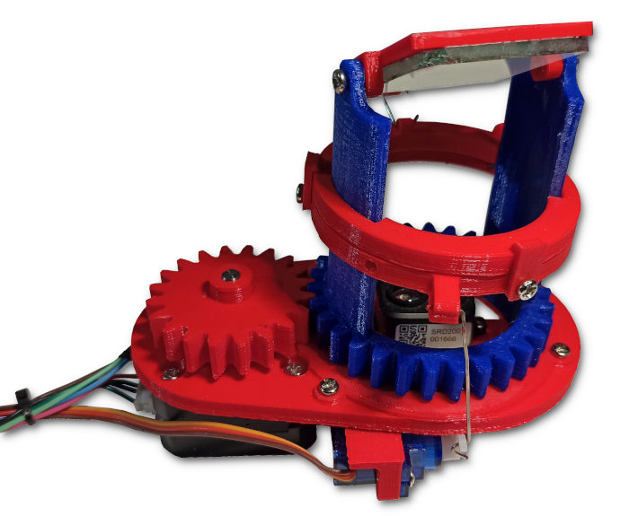

# 3D Lidar scanner

Lidars (LIgh Detection And Ranging) measure distances by illuminating the target with laser light and measuring the reflection with a sensor.

Link to the article: http://charleslabs.fr/en/project-3D+Lidar+Scanner+MK2

This is my 3D Lidar:

This repository contains the source files to build it:
* Mechanical: STL files for 3D-printing, linkages bending patterns and SolidWorks source files,
* Electronics: circuit diagram,
* Arduino code: the Arduino project for the micro-controller,
* Processing code: the LidarViewer Processing sketch.

## BOM

This is the projects' BOM:

| Quantity | Item                                     | Total cost |
|----------|------------------------------------------|------------|
| 1        | STM32F103 board                          | $2         |
| 1        | Mini 360 DC Buck Converter               | $1         |
| 1        | DRV8825 Stepper Motor Driver             | $0.9       |
| 1        | TF-Luna LiDAR Range Finder Sensor Module | $20        |
| 1        | 17HS4023 stepper motor                   | $7.3       |
| 2        | 9g Sg90 Miniature Servo Motor            | $2.6       |
| 1        | USB 2.0 to UART Serial Converter Module  | $1         |
| 15       | M3×6mm screw                             | $2         |
| 2        | M2.5 screw                               | $1         |
| /        | PLA filament                             | About $3   |
| 1        | 40&times;40 piece of mirror              | /          |
| 1        | Breadboard                               | $1         |